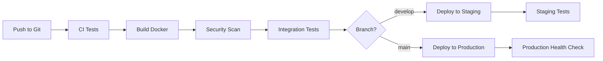

# 🏆 FUSAF - Система управління федерацією

<div align="center">

[](https://github.com/fusaf-ukraine/fusaf-system/actions/workflows/ci-cd.yml)
[](https://github.com/fusaf-ukraine/fusaf-system/actions/workflows/tests.yml)
[](https://github.com/fusaf-ukraine/fusaf-system/actions/workflows/security.yml)
[](https://fusaf.org.ua/docs)
[](LICENSE)

**Федерація України зі Спортивної Аеробіки і Фітнесу (ФУСАФ)**

*Професійна система управління спортивною федерацією з повним функціоналом*

[🌐 Веб-сайт](https://fusaf.org.ua) • [📚 API Документація](https://fusaf.org.ua/docs) • [🔧 Адмінпанель](https://fusaf.org.ua/admin) • [📊 Аналітика](https://fusaf.org.ua/admin/analytics)

</div>

## 🌟 Особливості системи

### 🏅 Управління спортсменами
- **Реєстр спортсменів** з повними профілями та досягненнями
- **Категорії та рівні** для різних вікових груп
- **Медичні довідки** та документооборот
- **Рейтингова система** та статистика виступів

### 👨‍🏫 Кваліфікаційний реєстр тренерів/суддів
- **Повний облік** всіх тренерів та суддів України
- **Система ліцензій** з термінами дії та попередженнями
- **Сертифікати** з верифікацією та контролем термінів
- **Спеціалізації** по всіх напрямках аеробіки
- **Регіональний розподіл** для планування розвитку

### 🏢 Управління клубами
- **Реєстр клубів** з детальною інформацією
- **Статистика членства** та досягнень
- **Контактна інформація** та реквізити
- **Система статусів** та верифікація

### 🏆 Змагання та реєстрації
- **Календар змагань** з різними рівнями
- **Онлайн реєстрація** спортсменів
- **Категорії та номінації** з автоматичним розподілом
- **Результати та протоколи**

### 📰 Система новин
- **Публікація новин** з SEO оптимізацією
- **Категорії та теги** для структурування
- **Рекомендовані** та закріплені статті
- **Аналітика переглядів** та популярності

### 🛡️ Адмінпанель суперадміністратора
- **Повне управління** всіма аспектами системи
- **Система ролей** та прав доступу
- **Аудит дій** з детальним логуванням
- **Email сповіщення** з шаблонами
- **Експорт даних** в Excel та JSON
- **Аналітика** з графіками та звітами

## 🚀 Технології

### Frontend
- **Next.js 14** з App Router
- **React 18** з TypeScript
- **Tailwind CSS** для стилізації
- **Radix UI** компоненти
- **Lucide Icons** для іконок
- **Responsive дизайн** для всіх пристроїв

### Backend
- **Next.js API Routes** з TypeScript
- **MySQL 8.0** база даних
- **JWT** автентифікація
- **bcrypt** хешування паролів
- **UUID** для безпечних ID

### DevOps & Production
- **Docker** контейнеризація
- **Nginx** reverse proxy з SSL
- **GitHub Actions** CI/CD
- **Automated testing** та якість коду
- **Security scanning** та аудит
- **Health monitoring** та логування

## 📚 API Документація

### 🔗 Доступ до документації
- **Swagger UI**: [https://fusaf.org.ua/docs](https://fusaf.org.ua/docs)
- **OpenAPI Spec**: [https://fusaf.org.ua/api/docs](https://fusaf.org.ua/api/docs)
- **Інтерактивне тестування** прямо в браузері

### 🔑 Автентифікація
```bash
# Отримання JWT токена
curl -X POST https://fusaf.org.ua/api/auth/login \
  -H "Content-Type: application/json" \
  -d '{"email": "user@example.com", "password": "password"}'

# Використання токена
curl -X GET https://fusaf.org.ua/api/auth/profile \
  -H "Authorization: Bearer YOUR_JWT_TOKEN"
```

### 📋 Основні endpoints
| Категорія | Endpoint | Опис |
|-----------|----------|------|
| 🔐 Auth | `/api/auth/login` | Вхід користувача |
| 👤 Users | `/api/admin/users` | Управління користувачами |
| 🏃 Athletes | `/api/athletes` | Список спортсменів |
| 👨‍🏫 Coaches | `/api/admin/coaches` | Тренери та судді |
| 🏢 Clubs | `/api/clubs` | Спортивні клуби |
| 🏆 Competitions | `/api/competitions` | Змагання |
| 📰 News | `/api/news` | Новини |
| 📊 Analytics | `/api/admin/analytics` | Аналітика |
| 💌 Notifications | `/api/admin/notifications` | Email сповіщення |
| 📋 Logs | `/api/admin/logs` | Аудит дій |
| 💾 Export | `/api/admin/export` | Експорт даних |
| 🔍 Health | `/api/health` | Перевірка здоров'я |

## 🔄 CI/CD Pipeline

### 🛠️ Автоматизація розробки
- **Код якість**: ESLint, Prettier, TypeScript
- **Тестування**: Unit, Integration, API, E2E
- **Безпека**: Security audit, Vulnerability scan
- **Продуктивність**: Lighthouse, Load testing

### 🚀 Deployment процес


### 🔄 Automated workflows
- **🧪 Tests**: Запускаються на кожен push/PR
- **🔒 Security**: Щоденне сканування залежностей
- **📦 Dependencies**: Тижневе оновлення пакетів
- **🚀 Deployment**: Автоматичний deployment на staging/production

## 🛠️ Розробка

### 📋 Передумови
- Node.js 18+
- Bun (package manager)
- MySQL 8.0
- Docker (опціонально)

### 🚀 Швидкий старт
```bash
# Клонування репозиторію
git clone https://github.com/fusaf-ukraine/fusaf-system.git
cd fusaf-system

# Встановлення залежностей
bun install

# Налаштування environment
cp .env.example .env.local
# Редагуйте .env.local з вашими налаштуваннями

# Запуск в режимі розробки
bun run dev

# Відкрийте http://localhost:3000
```

### 🧪 Тестування
```bash
# Unit тести
bun run test

# Integration тести
bun run test:integration

# API тести
bun run test:api

# E2E тести
bun run test:e2e

# Покриття коду
bun run test:coverage
```

### 🐳 Docker розробка
```bash
# Запуск всього стеку
docker-compose -f docker-compose.dev.yml up

# Тільки база даних
docker-compose -f docker-compose.dev.yml up mysql
```

## 🌐 Production Deployment

### 📦 Docker deployment
```bash
# Клонування на сервер
git clone https://github.com/fusaf-ukraine/fusaf-system.git
cd fusaf-system

# Налаштування production environment
cp env.production.example .env.production
# Заповніть реальні дані

# Запуск deployment скрипта
chmod +x scripts/deploy.sh
./scripts/deploy.sh
```

### ☁️ Хмарне розгортання
Система готова для deployment на:
- **AWS** (ECS, RDS, CloudFront)
- **Google Cloud** (Cloud Run, Cloud SQL)
- **DigitalOcean** (App Platform, Managed Database)
- **Azure** (Container Instances, Database)

## 📊 Моніторинг та логування

### 🔍 Health checks
- **Application**: `/api/health`
- **Database**: Автоматична перевірка з'єднання
- **System resources**: Контроль пам'яті та CPU
- **External services**: SMTP, третьої сторони API

### 📈 Аналітика
- **Користувачі**: Активність та поведінка
- **Продуктивність**: Час відгуку та помилки
- **Бізнес метрики**: Реєстрації, змагання, клуби
- **Системні метрики**: Ресурси сервера

## 🔒 Безпека

### 🛡️ Заходи безпеки
- **HTTPS** обов'язковий для всіх з'єднань
- **JWT** токени з коротким терміном дії
- **bcrypt** для хешування паролів
- **SQL injection** захист через параметри
- **XSS** захист через CSP заголовки
- **Rate limiting** для API endpoints
- **OWASP** рекомендації

### 🔍 Аудит та логування
- **Всі дії адміністраторів** логуються
- **Спроби входу** відстежуються
- **Помилки** централізовано збираються
- **Підозріла активність** автоматично детектується

## 🤝 Внесок у розробку

### 🔀 Git workflow
1. Fork репозиторію
2. Створіть feature branch (`git checkout -b feature/amazing-feature`)
3. Commit зміни (`git commit -m 'Add amazing feature'`)
4. Push до branch (`git push origin feature/amazing-feature`)
5. Створіть Pull Request

### 📋 Стандарти коду
- **TypeScript** строгий режим
- **ESLint** конфігурація
- **Prettier** форматування
- **Conventional commits** для повідомлень
- **Unit tests** для нового функціоналу

### 🧪 Тестування
- Всі PR проходять автоматичне тестування
- Code coverage має бути > 80%
- Integration тести обов'язкові для API
- E2E тести для критичних функцій

## 📄 Ліцензія

Цей проект має пропрієтарну ліцензію. Всі права належать Федерації України зі Спортивної Аеробіки і Фітнесу (ФУСАФ).

## 📞 Підтримка

### 💬 Контакти
- **Email**: tech@fusaf.org.ua
- **Сайт**: https://fusaf.org.ua
- **Issues**: [GitHub Issues](https://github.com/fusaf-ukraine/fusaf-system/issues)

### 📚 Документація
- **Користувачів**: [docs.fusaf.org.ua](https://docs.fusaf.org.ua)
- **API**: [fusaf.org.ua/docs](https://fusaf.org.ua/docs)
- **Адміністраторів**: [admin-docs.fusaf.org.ua](https://admin-docs.fusaf.org.ua)

---

<div align="center">

**🏆 Створено з ❤️ для української спортивної аеробіки**

[](https://fusaf.org.ua)
[](https://nextjs.org/)
[](https://bun.sh/)

</div>
